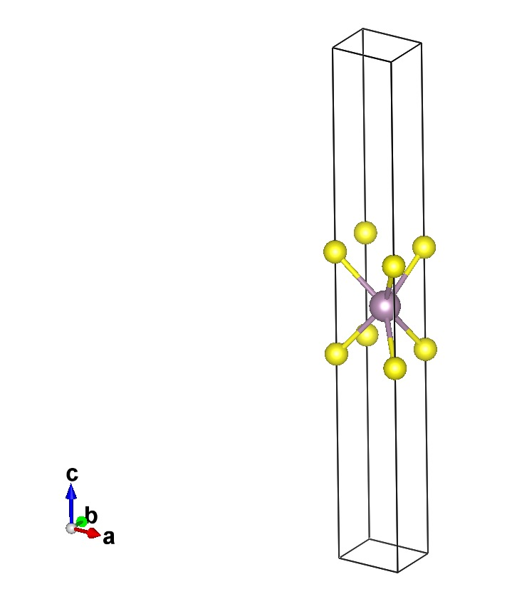
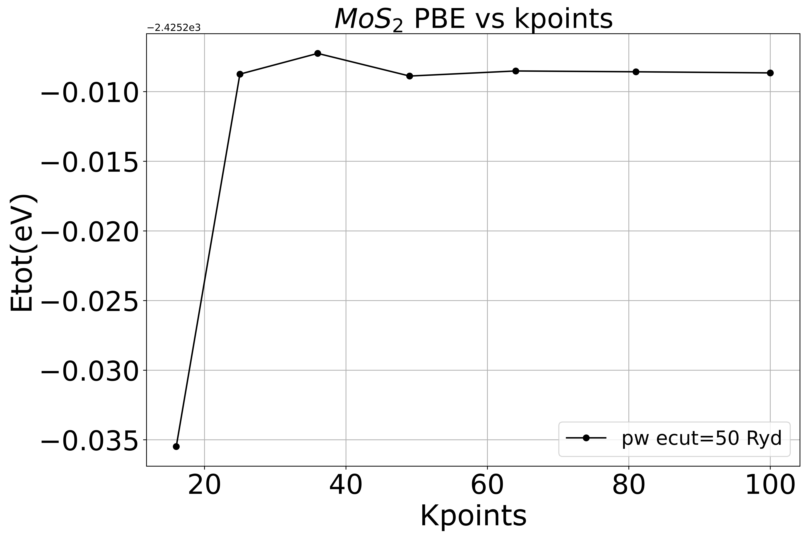
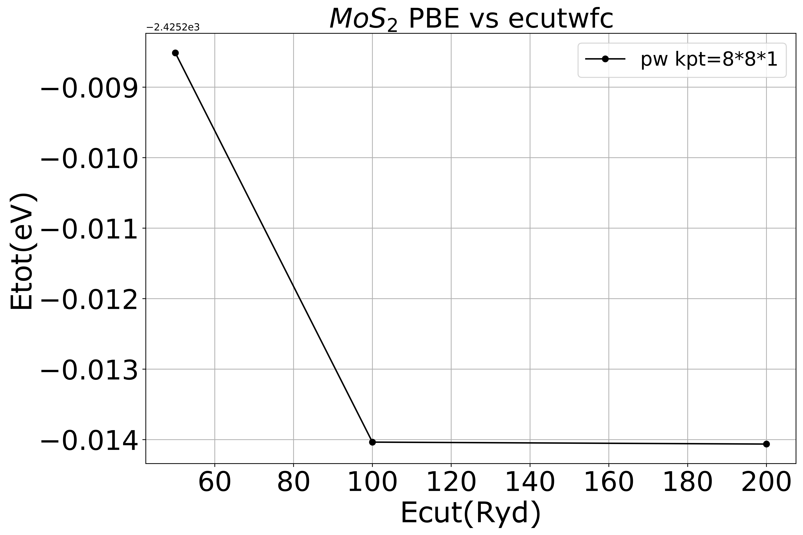
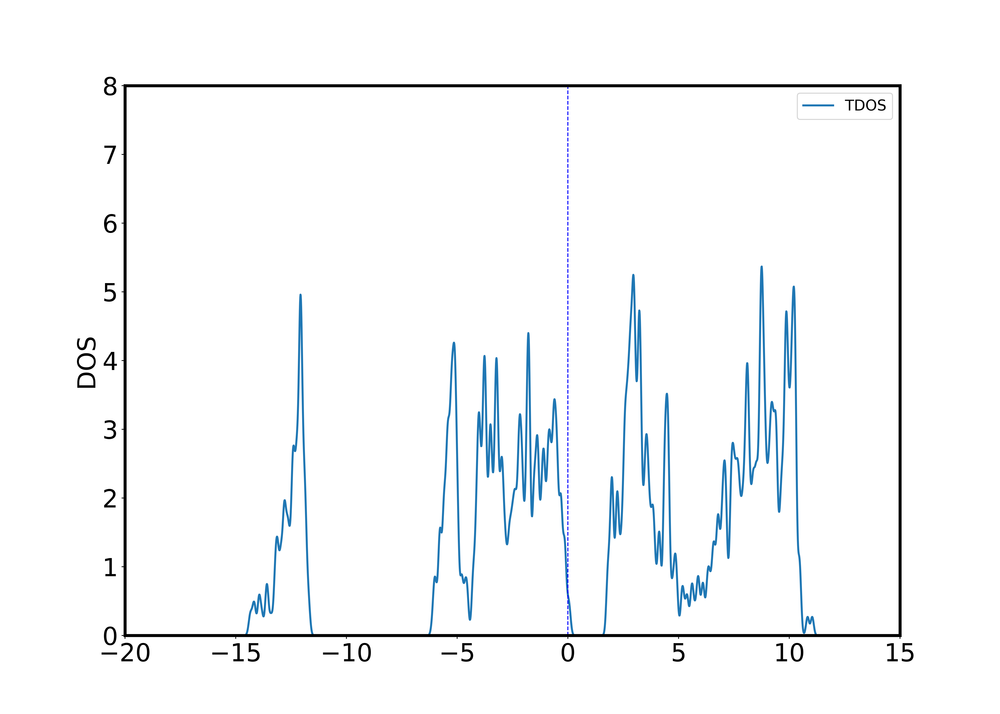
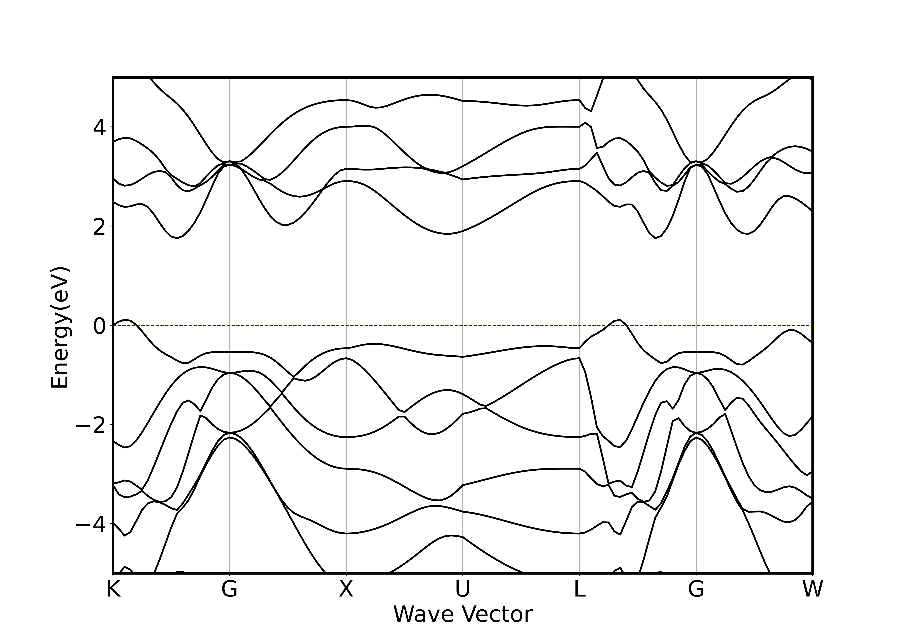
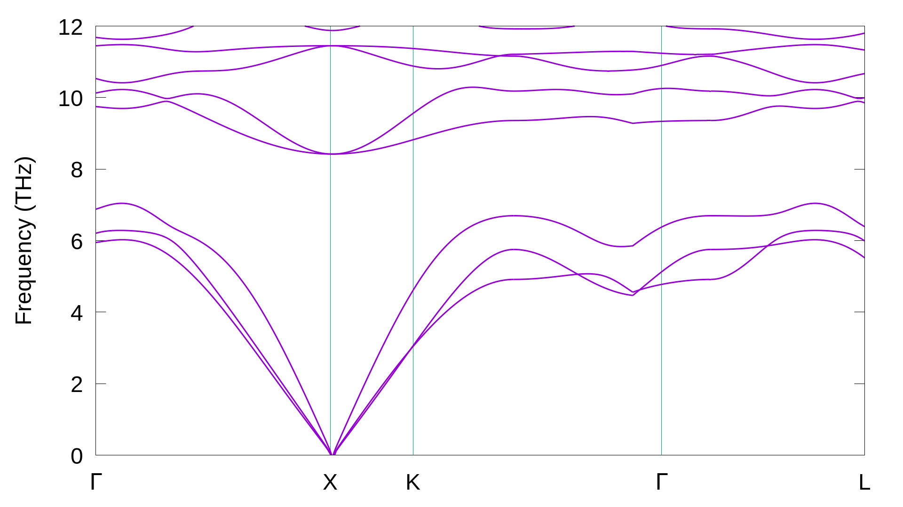

# $MoS_2$ 测试

>  Author: 龚环京
>
>  Input files: <https://github.com/AroundPeking/MoS2.git>

[toc]

本测试基于`ABACUS`的赝势平面波计算，所有计算采用交换关联泛函为PBE的DFT方法(最后声子谱计算采用数值原子轨道)。$MoS_2$选择$2H$构型，即上下Sulfur层xy坐标一致。

## 参数收敛测试

### k点数

在7\*7\*1处基本收敛，最后选择8\*8\*1的k点采样

### 平面波能量截断

选择100 Ryd的能量截断

### 真空层厚度

在13 $\AA$ 处已经基本收敛

## 几何结构优化

晶格矢量：

$$ \begin{pmatrix} a & 0 & 0 \\ -{1\over 2}a & -{\sqrt{3}\over 2}a & 0 \\ 0 & 0 & z \end{pmatrix} \tag{3} $$

### 晶格常数 a

固定z方向晶格常数不变，优化xy平面晶格常数a。

二维平面晶格常数`a=3.04  `$\AA$

### 原子层厚度c

固定真空层厚度15$\AA$和xy方向`a=3.04`$\AA$，优化z方向晶格常数c。

z方向晶格常数`z=3.25`$\AA$ 

## 结构性质

### 态密度

### 能带

### 声子谱

